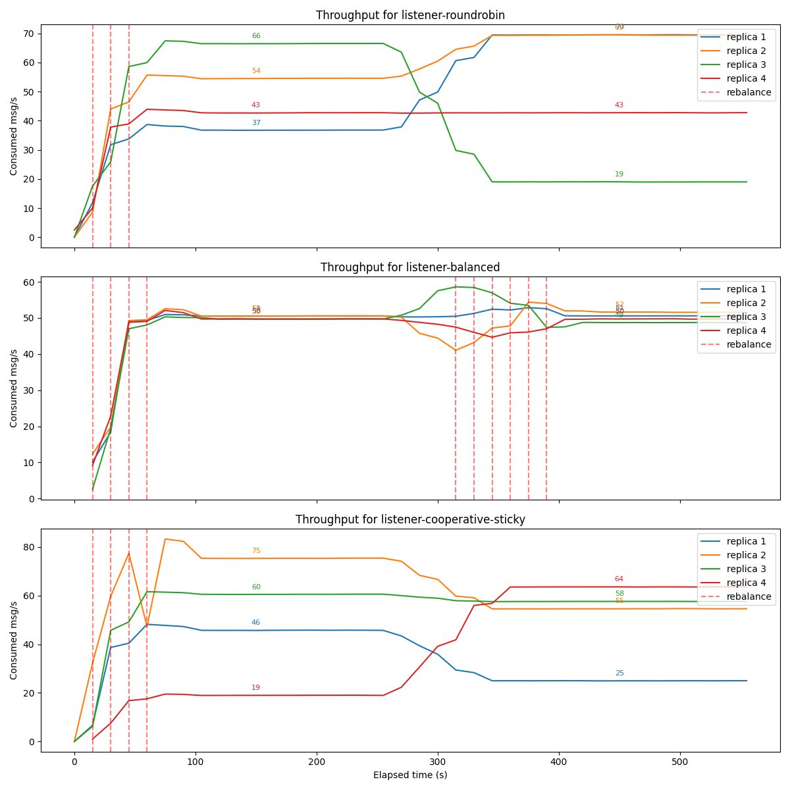

# Performance: Load-Aware Assignor vs. Kafka's Default Assignors

**TL;DR** — Under a realistic, skewed workload Kafka's built-in assignors leave
some consumers saturated while others sit nearly idle, because they balance the
*number* of partitions, not the *load* on them. The library's
[`LoadAwarePartitionAssignor`](../../consumer-balancer-core/src/main/java/io/github/ruskaof/balancer/LoadAwarePartitionAssignor.java)
balances *measured load* and keeps every consumer close to the group average.

---

## Why the default assignors fall short

Kafka's stock assignors — `RoundRobinAssignor`, `RangeAssignor`,
`CooperativeStickyAssignor` — distribute partitions by **count**. They have no
idea that, in a real topic, partition 7 might carry 10× the traffic of
partition 12.

When per-partition traffic is uneven (which is the norm: hot keys, skewed
hashing, per-tenant volume differences), an even *count* split produces a very
uneven *load* split. A consumer that happens to land several hot partitions runs
near saturation and becomes the group's bottleneck — the first to build lag and
the first to blow its latency budget — while consumers holding cold partitions
waste capacity.

The load-aware assignor instead pulls a per-partition throughput weight from
Prometheus and assigns partitions so that the **total weight per consumer** is
even. When the load distribution drifts, it
[proactively rebalances](../triggers/README.md) to restore balance.

---

## Test setup

The comparison runs all three strategies side by side in the
[`docker/`](../../docker/docker-compose.yaml) harness:

- **One topic, 32 partitions.** Three independent consumer groups, identical in
  every way except the assignor:
  - `listener-roundrobin` — `RoundRobinAssignor` (balancer off)
  - `listener-cooperative-sticky` — `CooperativeStickyAssignor` (balancer off)
  - `listener-balanced` — `LoadAwarePartitionAssignor` (balancer on)
- **4 instances × concurrency 2 = 8 consumers per group**, so ~4 partitions per
  consumer on average.
- **Skewed, shifting workload** (`test-scripts/load-generator`): partitions are
  split into high- (every 50 ms), medium- (every 200 ms) and low-traffic (every
  500 ms) sets. The run is two 300-second iterations, and the high/medium/low
  partition sets are **reshuffled between iterations** to simulate a hotspot that
  moves over time.
- **Metric:** per-instance consumed message rate
  (`kafka_consumer_fetch_manager_records_consumed_rate`). Red dashed lines mark
  rebalances. **A well-balanced group shows four lines bunched tightly together;
  a poorly balanced one shows them fanned apart.**

---

## Results

| Group | Spread across instances | Behaviour |
| --- | --- | --- |
| **round-robin** | ~19 → ~99 msg/s (≈5× gap) | Heavily uneven. After the hotspot moves (~300 s) one instance spikes toward 99 msg/s while another collapses to ~19. |
| **cooperative-sticky** | ~25 → ~75 msg/s (≈3× gap) | Also uneven — and because stickiness minimises partition movement, the imbalance gets *pinned in place* instead of being corrected. |
| **load-aware (this library)** | ~50 → ~53 msg/s (near-flat) | All four instances track the group average. When the hotspot shifts it fires a burst of proactive rebalances (~300–390 s) and re-converges. |

The extra rebalances visible in the load-aware panel are the **proactive** ones:
when the load distribution drifts past the imbalance threshold, the coordinator
re-runs the assignor. The default groups only rebalance at startup, so once they
land in an unbalanced state they stay there.

---

## What this buys you

Note that total messages consumed is similar across all three groups — the
producer is rate-limited, so this is about *distribution*, not raw aggregate
throughput. Even distribution matters because:

- **No single hotspot.** The busiest round-robin consumer does ~2× the work of an
  average load-aware one. That hot consumer is the first to fall behind, the first
  to exceed its latency SLA, and the heaviest on CPU/memory.
- **Better utilisation.** Idle consumers holding cold partitions are wasted
  capacity; the library puts them to work.
- **Provision for the average, not the peak.** With balanced load you size the
  fleet for mean load; with count-based assignment you must size for whichever
  consumer drew the worst hand.
- **Resilience to shifting load.** Real hotspots move. Proactive rebalancing keeps
  the group balanced as the distribution changes, instead of locking in whatever
  split happened at the last membership change.

---

## When the defaults are good enough

To be fair: if your per-partition load is roughly **uniform**, the built-in
assignors already balance load and this library adds little. The load-aware
assignor also requires a Prometheus source for weights and pays a (small)
proactive-rebalance cost. The win is real specifically when load is **skewed**
and uneven consumer utilisation is expensive — which, for most non-trivial
topics, it is.
