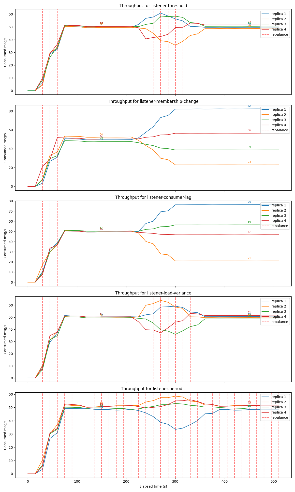

# Rebalance Triggers

A **rebalance trigger** decides *when* the library should proactively re-run the
load-aware partition assignment. It is the single-method interface
[`RebalanceTrigger`](../../consumer-balancer-core/src/main/java/io/github/ruskaof/balancer/trigger/RebalanceTrigger.java):

```java
@FunctionalInterface
public interface RebalanceTrigger {
    boolean shouldTrigger();
}
```

The elected coordinator (`CoordinatorManager`) calls `shouldTrigger()` on a fixed
schedule (`consumer-balancer.coordinator.trigger-check-interval`, default 30s).
When it returns `true`, the coordinator forces a group rebalance, which re-runs
`LoadAwarePartitionAssignor` and redistributes partitions according to the latest
per-partition weights.

This is **proactive** rebalancing: Kafka already rebalances *reactively* on
membership changes, but it never re-balances on its own just because the load
across already-assigned partitions has drifted. Triggers fill that gap.

---

## Implemented triggers

### `ThresholdTrigger` — the default

Describes the consumer group, pulls per-partition weights from Prometheus,
computes the *optimal* assignment via the `BalanceService`, and compares the
**current** most-loaded member against the **optimal** most-loaded member. It
fires when:

```
currentMaxLoad / optimalMaxLoad > rebalanceLoadImbalanceThreshold   (default 1.1)
```

| Pros | Cons |
| --- | --- |
| Proactive: reacts to load skew *before* it turns into lag or latency. | Requires Prometheus and a working weight query. |
| Compares against the *best achievable* assignment, so it stays quiet when an imbalance is unavoidable (e.g. one dominant partition). | Heaviest trigger: admin describe + weight fetch + optimal computation on every check. |
| Directly optimizes the thing you care about — balanced load. | Needs the threshold tuned to the workload. |

### `PeriodicTrigger`

Fires whenever a fixed interval has elapsed since the last fire, regardless of
load.

| Pros | Cons |
| --- | --- |
| Trivial, dependency-free, completely predictable. | Rebalances even when nothing is wrong — every rebalance is a stop-the-world pause for the group. |
| Great as a safety net or as one leg of a `CompositeTrigger` to bound how stale an assignment can get. | Blind to actual load; too long an interval reacts slowly, too short churns. |

### `CompositeTrigger`

Combines several triggers with `ANY` (fire if any child fires) or `ALL` (fire
only if all children fire) semantics.

| Pros | Cons |
| --- | --- |
| Lets you express real policies, e.g. *"rebalance if load is imbalanced **or** it has been an hour"*, or *"only during the maintenance window **and** when imbalanced"*. | Only as good as the triggers it wraps. |
| Keeps individual triggers small and single-purpose. | No built-in cooldown; rapid re-firing must be handled by the children. |

### Extending

Implement `RebalanceTrigger` and publish it as a bean — the auto-configuration
backs off its default (`@ConditionalOnMissingBean(RebalanceTrigger.class)`), so
any custom strategy takes over.

---

## Considered but intentionally not implemented

While designing the library we evaluated three more triggers. Each is reasonable
in isolation, but none earned a place in the library once `ThresholdTrigger`
existed. The comparison run below was used to confirm this empirically.

### Membership-change trigger

**Idea:** fire whenever the set of group members changes (an instance joins,
leaves, or crashes).

**Why it was not implemented:** this is already what Kafka does *by default*. The
consumer group protocol triggers a rebalance on every membership change, and our
custom assignor runs as part of that native rebalance. A proactive trigger here
would only re-detect an event Kafka has already handled — it is redundant. As the
chart shows, the membership-change group never reacts to the load skew that
appears mid-run (no membership event occurs), so its replicas drift apart and
stay imbalanced.

### Consumer-lag trigger

**Idea:** compute per-member consumer lag (end offset − committed offset) and fire
when one member is disproportionately behind.

**Why it was not implemented:** lag is a *lagging, downstream symptom*. A member
only accumulates lag *after* it has already been overloaded for a while.
`ThresholdTrigger` sees the same imbalance directly from the throughput-rate
weights and acts *before* lag builds up. Its only real advantage — not needing
Prometheus — does not apply here, because the load-aware assignor already depends
on Prometheus for weights. So with `ThresholdTrigger` present, a lag trigger is
simply a slower, more reactive version of something we already do better.

### Load-variance trigger

**Idea:** compute the coefficient of variation (std-dev / mean) of per-member load
and fire when dispersion is high.

**Why it was not implemented:** it measures essentially the *same quantity* as
`ThresholdTrigger` — imbalance of per-member load derived from Prometheus weights —
just with a different statistic. The decisive difference is that `ThresholdTrigger`
compares the current assignment against the **optimal achievable** assignment, so
it will not fire when an imbalance cannot actually be improved. Variance has no
notion of "best achievable" and would keep firing (churning the group) trying to
flatten an imbalance that is structurally unavoidable. Threshold is the
better-targeted version of the same idea.

---

## Empirical comparison

All five groups below run the **same** `LoadAwarePartitionAssignor` with proactive
rebalancing enabled; they differ *only* in the trigger. Each panel shows the
per-replica consumed message rate over time; red dashed lines mark rebalances.
The workload ramps up, then shifts the high/medium/low-traffic partitions mid-run
to create load skew.



What the run shows:

- **threshold** — rebalances when skew appears and pulls the replicas back
  together; good balance for relatively few rebalances.
- **membership-change** — no membership event occurs after startup, so it never
  reacts; replicas diverge and stay imbalanced. Confirms it adds nothing over
  Kafka's default behavior.
- **consumer-lag** — reacts only once lag has already built up; slower to correct
  and the replicas spend longer imbalanced.
- **load-variance** — behaves much like threshold, confirming it targets the same
  imbalance — but without threshold's "don't fire if it can't be improved"
  guard.
- **periodic** — rebalances on a steady cadence regardless of need; it keeps
  things balanced but pays a constant rebalance cost (the many evenly-spaced red
  lines).

**Conclusion:** `ThresholdTrigger` gives the best balance-to-rebalance-cost
tradeoff, which is why it is the library default. `PeriodicTrigger` and
`CompositeTrigger` remain available as simple, composable building blocks; the
three alternatives above were left out because each is either redundant with
Kafka itself or strictly dominated by the threshold trigger.
