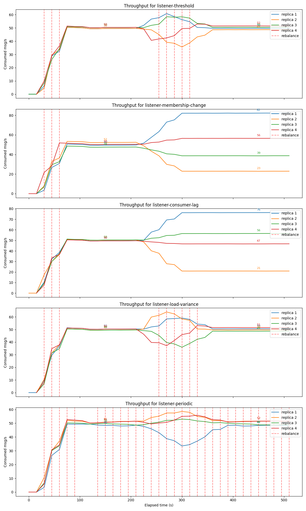

# Rebalance Triggers

A **rebalance trigger** decides *when* the library should proactively re-run the
load-aware partition assignment. It is the single-method interface
[`RebalanceTrigger`](../../consumer-balancer-core/src/main/java/io/github/ruskaof/balancer/trigger/RebalanceTrigger.java):

```java
@FunctionalInterface
public interface RebalanceTrigger {
    boolean shouldTrigger();
}
```

The designated coordinator (`CoordinatorManager`) calls `shouldTrigger()` on a fixed
schedule (`consumer-balancer.coordinator.trigger-check-interval`, default 30s).
When it returns `true`, the manager revalidates ownership, advances the request
revision in subscription metadata, and requests a group rebalance, which re-runs
`LoadAwarePartitionAssignor` and redistributes partitions according to the latest
per-partition weights. Changing the revision ensures that a request made by a
nonleader consumer is visible to Kafka as a subscription change.

`ConsumerGroupBalancers` wires the assignor, election, trigger and manager to one
shared `MemberIdTracker`; this is the recommended API for proactive monitoring.
For manual core wiring, follow the [configuration instructions](../../README.md#assignor-configuration-consumer-configs),
including the election's required `setMemberIdTracker`. The manager obtains the
same tracker from that election automatically.

This is **proactive** rebalancing: Kafka already rebalances *reactively* on
membership changes, but it never re-balances on its own just because the load
across already-assigned partitions has drifted. Triggers fill that gap.

---

## Implemented triggers

### `ThresholdTrigger` — the default

Describes the consumer group, pulls per-partition weights from the configured
weight store (by default, end-offset rates measured through the Kafka
AdminClient), computes the *optimal* assignment via the `BalanceService`, and
compares the **current** most-loaded application instance against the
**optimal** most-loaded instance. Instance grouping and actual topic subscriptions
come from a topology snapshot sent **only to the monitoring consumer**. Other
consumers receive small acknowledgements of their own metadata. The AdminClient
supplies current assignments; `MemberIdTracker` resolves the snapshot's consumer
identities against that live membership. An absent or stale topology pauses the
check. Idle members retain their actual subscription eligibility. The imbalance is:

```
currentMaxInstanceLoad / optimalMaxInstanceLoad > rebalanceLoadImbalanceThreshold   (default 1.1)
```

The assignor chooses the smallest typed identity among consumers advertising
monitoring support: `s:<group.instance.id>` for static consumers, or `m:<memberId>`
for dynamic consumers. The full snapshot and all acknowledgements together have
a **512 KiB** budget. Sending one snapshot removes the previous duplication per
member; native Kafka metadata limits still apply. Exceeding this budget disables
monitoring with a warning while partition assignment continues.

Seeing an imbalance once is *not* enough to fire. The monitor measures weights
at a different moment from the Kafka group leader, so they can disagree about
the best assignment. Three guards (`RebalanceDamping`) bound the rebalance rate:

- **stable groups only** — a check landing mid-rebalance is skipped, never acted
  on, because the AdminClient then reports partial or previous-generation
  assignments and firing on those re-fires on the rebalance just caused;
- **hysteresis** — the imbalance must hold for
  `consumer-balancer.rebalance-min-violated-checks` checks of one unchanged
  assignment (default `2`). A balanced check decays that count by one rather than
  resetting it, so the ratio drifting across the threshold — which is exactly what
  happens while the weight window still spans the load being replaced — still
  converges on a decision;
- **cooldown with backoff** — fires are at least
  `consumer-balancer.rebalance-cooldown` apart (default `10m`) whatever happened
  in between, and each fire that does not restore balance doubles that distance
  up to `consumer-balancer.rebalance-max-cooldown` (default `2h`), logging a
  warning that names the likely cause. Seeing the group balanced winds the
  cooldown back to its base.

Static membership does not require an explicit application-instance id. Each JVM
can keep using its automatically generated id. If Kafka replays an assignment
after a restart, the consumer checks its acknowledged instance id and topics
against the current process. A mismatch requests a fresh assignment, including
from a nonmonitor JVM. Recovery coalesces local requests, uses backoff, and waits
for a stable group; it can add a group rebalance after a static restart. A fresh,
matching acknowledgement stops recovery. Missing or corrupt metadata and an
exceeded size budget do not initiate repeated refreshes.

The new metadata format requires a coordinated group upgrade. Mixed-version
proactive operation is not guaranteed until the new assignor produces a fresh
topology. Recognized legacy assignments cached by Kafka for static members are
refreshed through the same recovery path. See [upgrade guidance](../../README.md#upgrading-monitoring-metadata).

| Pros | Cons |
| --- | --- |
| Proactive: reacts to load skew *before* it turns into lag or latency. | Needs a working weight store (the default offset-rate store requires no extra infrastructure). |
| Compares against the *best achievable* assignment, so it stays quiet when an imbalance is unavoidable (e.g. one dominant partition). | Heaviest trigger: admin describe + weight fetch + optimal computation on every check. |
| Directly optimizes the thing you care about — balanced load. | Needs the threshold tuned to the workload. |
| Bounded blast radius: a wrong verdict costs one rebalance, then backs off. | Correspondingly slow: a real imbalance takes `min-violated-checks` checks to act on. |

### `PeriodicTrigger`

Fires whenever a fixed interval has elapsed since the last fire, regardless of
load.

| Pros | Cons |
| --- | --- |
| Trivial, dependency-free, completely predictable. | Rebalances even when nothing is wrong — every rebalance is a stop-the-world pause for the group. |
| Great as a safety net or as one leg of a `CompositeTrigger` to bound how stale an assignment can get. | Blind to actual load; too long an interval reacts slowly, too short churns. |

### `CompositeTrigger`

Combines several triggers with `ANY` (fire if any child fires) or `ALL` (fire
only if all children fire) semantics.

| Pros | Cons |
| --- | --- |
| Lets you express real policies, e.g. *"rebalance if load is imbalanced **or** it has been an hour"*, or *"only during the maintenance window **and** when imbalanced"*. | Only as good as the triggers it wraps. |
| Keeps individual triggers small and single-purpose. | No built-in cooldown; rapid re-firing must be handled by the children (`ThresholdTrigger` brings its own, `PeriodicTrigger` is its own). |

### Extending

Implement `RebalanceTrigger` and publish it as a bean — the auto-configuration
backs off its default (`@ConditionalOnMissingBean(RebalanceTrigger.class)`), so
any custom strategy takes over.

---

## Considered but intentionally not implemented

While designing the library we evaluated three more triggers. Each is reasonable
in isolation, but none earned a place in the library once `ThresholdTrigger`
existed. The comparison run below was used to confirm this empirically.

### Membership-change trigger

**Idea:** fire whenever the set of group members changes (an instance joins,
leaves, or crashes).

**Why it was not implemented:** this is already what Kafka does *by default*. The
consumer group protocol triggers a rebalance on every membership change, and our
custom assignor runs as part of that native rebalance. A proactive trigger here
would only re-detect an event Kafka has already handled — it is redundant. As the
chart shows, the membership-change group never reacts to the load skew that
appears mid-run (no membership event occurs), so its replicas drift apart and
stay imbalanced.

### Consumer-lag trigger

**Idea:** compute per-member consumer lag (end offset − committed offset) and fire
when one member is disproportionately behind.

**Why it was not implemented:** lag is a *lagging, downstream symptom*. A member
only accumulates lag *after* it has already been overloaded for a while.
`ThresholdTrigger` sees the same imbalance directly from the throughput-rate
weights and acts *before* lag builds up. So with `ThresholdTrigger` present, a
lag trigger is simply a slower, more reactive version of something we already do
better.

### Load-variance trigger

**Idea:** compute the coefficient of variation (std-dev / mean) of per-member load
and fire when dispersion is high.

**Why it was not implemented:** it measures essentially the *same quantity* as
`ThresholdTrigger` — imbalance of per-member load derived from the weight store —
just with a different statistic. The decisive difference is that `ThresholdTrigger`
compares the current assignment against the **optimal achievable** assignment, so
it will not fire when an imbalance cannot actually be improved. Variance has no
notion of "best achievable" and would keep firing (churning the group) trying to
flatten an imbalance that is structurally unavoidable. Threshold is the
better-targeted version of the same idea.

---

## Empirical comparison

All five groups below run the **same** `LoadAwarePartitionAssignor` with proactive
rebalancing enabled; they differ *only* in the trigger. Each panel shows the
per-replica consumed message rate over time; red dashed lines mark rebalances.
The workload ramps up, then shifts the high/medium/low-traffic partitions mid-run
to create load skew.



What the run shows:

- **threshold** — rebalances when skew appears and pulls the replicas back
  together; good balance for relatively few rebalances.
- **membership-change** — no membership event occurs after startup, so it never
  reacts; replicas diverge and stay imbalanced. Confirms it adds nothing over
  Kafka's default behavior.
- **consumer-lag** — reacts only once lag has already built up; slower to correct
  and the replicas spend longer imbalanced.
- **load-variance** — behaves much like threshold, confirming it targets the same
  imbalance — but without threshold's "don't fire if it can't be improved"
  guard.
- **periodic** — rebalances on a steady cadence regardless of need; it keeps
  things balanced but pays a constant rebalance cost (the many evenly-spaced red
  lines).

**Conclusion:** `ThresholdTrigger` gives the best balance-to-rebalance-cost
tradeoff, which is why it is the library default. `PeriodicTrigger` and
`CompositeTrigger` remain available as simple, composable building blocks; the
three alternatives above were left out because each is either redundant with
Kafka itself or strictly dominated by the threshold trigger.
